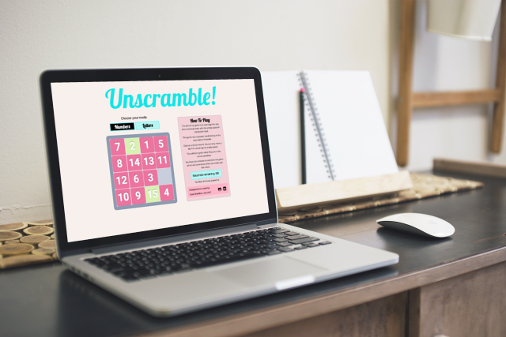
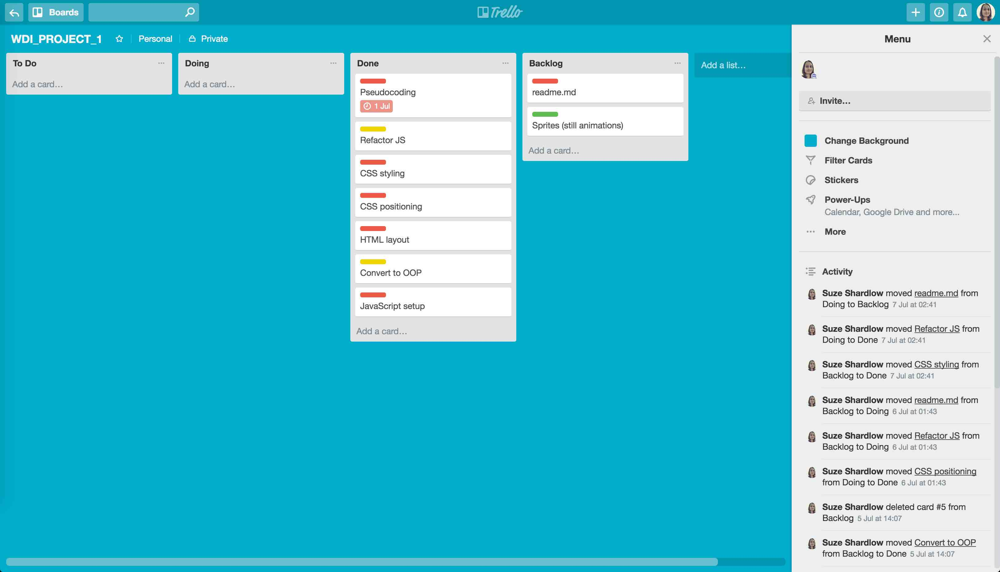

# Unscramble!

[Play it here!](https://suze.dev/coding_projects/unscramble/)

## Introduction

I recently trained to become a software engineer at a 12-week web development immersive bootcamp.

**After the first two weeks of classes (which covered HTML, CSS, basic JavaScript, jQuery and object-oriented programming), we were tasked to create a game using JavaScript in just seven days.**

To challenge myself and test my understanding of creating methods and functions and manipulating a DOM, I chose a game which was heavy on logic.

I decided to digitise a toy I enjoyed playing with when I was a child - picture courtesy of Pinterest:

## Brief

To create a JavaScript game of our choice, with HTML and CSS so that the user can play it in the browser.

## The game

The game board consists of 16 positions and 15 tiles in a 4x4 grid.  Depending on the mode, the tiles bear either a number or a letter.

The aim of the game is to move the tiles around the board so that they appear in numerical or alphabetical order, with the empty space in the bottom right.

Tiles can only be moved if they touch the empty space.

## Planning

Before programming anything, I wrote some pseudocode describing what I needed to happen.  This helped me to break everything down into a set of small problems.  For example:

* A 4x4 grid needs to appear on the screen.
* Each position on the grid needs to be identified by an ID number.
* A number tile needs to appear in 15 of the 16 positions.  Therefore create a set of grids and apply one of them to the game.
* Before the game starts and after each move, we need to compare the number on the tile with the position ID number.
* If they match, then the tile is in the correct position and it must be shown in green.
* If all the tiles are green, then the player has won and the game is over.
* If they do not match, the tile is not in the correct position and it must be shown in red.
* Listen for a click on a position in the grid.
* When the user clicks on a tile, we must check to see if it is a tile that can be legally moved, ie see if it is touching the empty space.
* If it is a legal move, then move the tile into the empty space.
* If it is not a legal move, then trigger an animation on the space.

From this, I determined the tasks I needed to undertake and plugged them into a [Trello](http://www.trello.com) board to help me stay on track.

## Build and Development

This game was built using JavaScript to handle the logic (check legal moves, check if the tiles were in the correct positions etc) and jQuery to manipulate the DOM.  I used CSS for the styling.

I defined the legal moves for each position on the grid and stored these in an array.

I also defined the start point combinations and created an array for each of them (see **Challenges**).

The code in this repo will run on your local machine without the need for an Internet connection.

## Challenges

I had a strange feeling at the outset of this project that I could not just randomise the numbers 1-15, drop them into the game board and expect that game board to be solvable.  I tested this theory beforehand and I realised I was correct - some number combinations can never be solved.  Therefore I had to spend some time playing with different combinations to come up with a few which were solvable.

The modal was also a challenge because it was something we were not due to cover in class until much later in the course.

## Bonus Functionality

I actually found myself with some spare time at the end of the project week, so for a bonus I decided to create a second mode with letters instead of numbers, because the original game actually came as a pair of two puzzles - one with numbers and one with letters.

I then added a countdown timer, giving the player two minutes to complete the game.

I also added a counter for the number of moves the player had made.

## Future Developments

When I created this game, we had not yet covered styling in any depth, so I would like to revisit it and make it responsive so it can be played on mobile phones.

I would also like to add more grid combinations.
